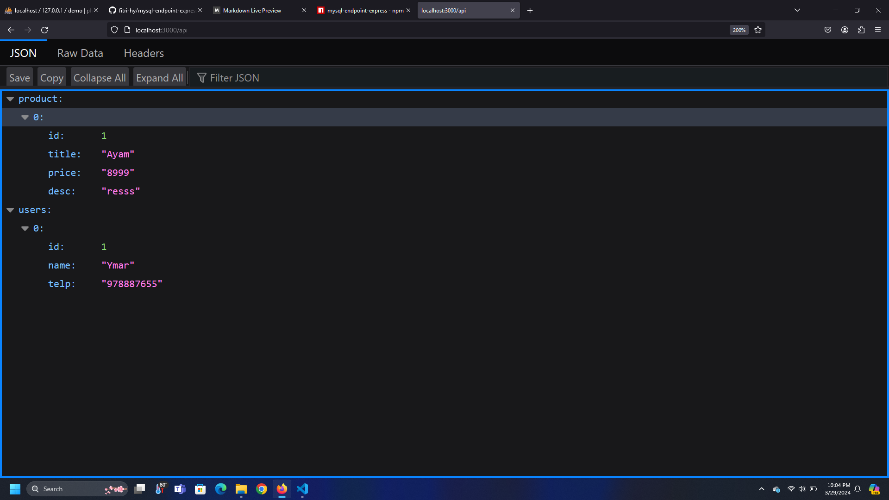

# MySQL Conecction ExpressJS
Connecting ExpressJS to MySQL and creating an API Endpoint.

### V1.0.6
[ADD] Role Statement
### V1.0.5
[ADD] Set request CORS in .env
### V1.0.3
[ADD] Method Operation Created, Read, Update, & Delete
### V1.0.2
[FIX] Cors Request



## NPM Installation
```sh
git clone https://github.com/fitri-hy/mysql-endpoint-express.git
cd mysql-endpoint-express
npm i mysql-endpoint-express
```

## Create & Configuration .env
```sh
DB_HOST=localhost
DB_PORT=5000
DB_USER=username
DB_PASSWORD=password
DB_DATABASE=database

PREFIX_ROLE='admin'
ALLOWED_ORIGIN='*'
ALLOWED_METHODS='GET, POST, PUT, DELETE'
ALLOWED_HEADERS='Content-Type, Authorization'
```
## Implementation index.js
```
require('mysql-endpoint-express');
```

## Run Server
```
node index.js`
```

## Testing Endpoint
Open in browser: `http://localhost:5000/api`
<hr/>

Don't forget to give stars
Follow Me: <a href="https://hy-tech.my.id/">FOLLOW</a>
